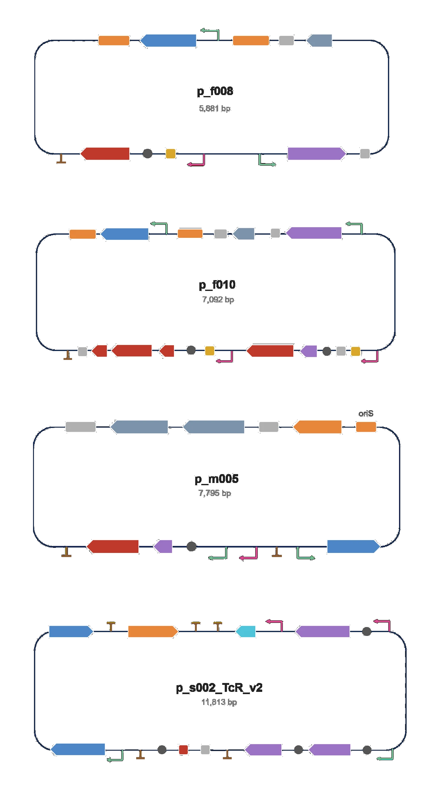
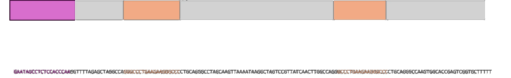

# Constructs

Constructs and their status. The design is described under
[Design](../project/design.md) and [Mechanism](../project/mechanism.md); the full
inventory with backbones and markers is [Table S1](supplementary.md#table-s1).

## Shell expression plasmids

All in pET-Duet-1 (ampicillin). The shell carries a lumenal λN⁺ peptide (GS
linker) as RNA handle; TP is the outer-surface targeting peptide.

| Construct | Shell | Second cassette | Status |
| --- | --- | --- | --- |
| `p_f008` | QtEnc, no His-tag or TP | — | Verified |
| `p_f009` | QtEnc + TP | — | Verified |
| `p_f010` | QtEnc (boxBr + λN) | mScarlet (FLAG + boxBr) | Verified |
| `p_f011` | QtEnc (boxBr + λN + TP) | mScarlet (FLAG + boxBr) | Verified |
| `p_f012`–`p_f017` | six combinations of boxBr, λN and TP | dCas9 (FLAG + IMEF + boxBr) | In assembly |

mScarlet (26.7 kDa) is a fluorescent cargo reporter used to follow co-elution
with the shell peak. Masses used for gel interpretation:

| Species | Mass |
| --- | --- |
| QtEncapsulin monomer | 32.2 kDa |
| QtEncapsulin + peptide fusion | 34.1 kDa |
| mScarlet | 26.7 kDa |
| Assembled T=4 shell | ~7.7 MDa |

## Mutation plasmids

Built on the MutaT7 backbones pDB004 and
pDB006. The QtEnc open reading frame sits between a T7
promoter and terminator.

| Construct | Content | Status |
| --- | --- | --- |
| `p_m005` | QtEnc, no TP or His-tag | Verified |
| `p_m006` | QtEnc + TP | Verified |
| `p_m007` | QtEnc + TP + His-tag | Verified |
| `p_m004`, `p_m008` | stop-codon reporters for MutaT7 validation | Verified |

## Selection plasmids

pSC101 backbone (kanamycin, plus a tetracycline-resistance cassette for
assembly), built by Golden Gate from five parts. dCas9 and the sgRNA are under
VanRAM and PhlFAM control.

| Construct | Complementarity | Role | Status |
| --- | --- | --- | --- |
| `p_s002_NT_TcR` | none | Non-targeting control, unrepressed output | In assembly |
| `p_s002_10nt_TcR` | 10 nt | Weakest repression | In assembly |
| `p_s002_11nt_TcR` | 11 nt | | In assembly |
| `p_s002_14nt_TcR` | 14 nt | | In assembly |
| `p_s002_17nt_TcR` | 17 nt | | In assembly |
| `p_s002_20nt_TcR` | 20 nt | Full complementarity, strongest repression | In assembly |

Four of five junctions form in two independent reactions; the TcR-to-backbone
junction is the open step ([Table S2](supplementary.md#table-s2),
[outlook](../project/results.md#outlook)).

<figure class="report narrow" markdown>

**Fig 1.** Maps of `p_f008` (**a**), `p_f011` (**b**), `p_m005` (**c**) and the
selection plasmid `s_002_TcR_creT_v2` (**d**).

</figure>

<figure class="report wide" markdown>

**Fig 2.** KanR-targeting sgRNA with the spacer and the boxB insertion sites in
the scaffold.

</figure>

## Handles

**Protein.** dCas9 carries the cargo-loading peptide (IMEF) at its C-terminus;
the core motif is five residues, `TVGSL`.

**RNA.** boxB hairpins in the sgRNA stem-loop and tetraloop, caught by λN⁺ on the
shell interior. A known lysine-to-arginine substitution in λN⁺ raises boxB
affinity roughly threefold if capture proves too weak.

## Controls

- **Non-targeting guide** (`s002_NT`): defines the unrepressed output. Survival at
  a kanamycin dose it cannot tolerate indicates a resistance mechanism
  independent of the selection.
- **Shell-free:** dCas9 and guide without encapsulin. Defines maximal repression
  without rescue.
- **Handle-free shell:** no λN graft and no CLP on dCas9. Separates handle-mediated
  capture from non-specific sequestration.
- **Single-handle constructs:** λN without the CLP, and the converse
  (`p_f014`–`p_f017`). They show which arm of the
  [OR gate](../project/design.md) is responsible for any rescue.

## Provenance

Addgene: `pdCas9-bacteria` (dCas9), `pSC101-T7-T3RNAP` and the pDB series (MutaT7).
Synthetic fragments from Twist Bioscience. Maps and sequences are kept in
Benchling; see [Attributions](../team/attributions.md).
