# Supplementary information

Tables S1–S2 and Figures S1–S14 of the [project report](../project/results.md),
with the captions as written there. Click a figure for the full-size image.

## Supplementary tables

### Table S1 — Plasmids and constructs {#table-s1}

An em dash in the Backbone column denotes a base vector not derived from another
entry in this table.

| Name | Backbone | Marker | Insert / function | Status |
| --- | --- | --- | --- | --- |
| **Shell expression series** | | | | |
| pET-Duet-1 | — | Amp | Empty expression vector | Verified |
| `p_f008` | pET-Duet-1 | Amp | QtEnc without His tag or TP | Verified |
| `p_f009` | pET-Duet-1 | Amp | QtEnc with TP | Verified |
| `p_f010` | pET-Duet-1 | Amp | QtEnc (boxBr + λN) and mScarlet (FLAG + boxBr) | Verified |
| `p_f011` | pET-Duet-1 | Amp | QtEnc (boxBr + λN + TP) and mScarlet (FLAG + boxBr) | Verified |
| `p_f012` | pET-Duet-1 | Amp | QtEnc (boxBr + λN) and dCas9 (FLAG + IMEF + boxBr) | In assembly |
| `p_f013` | pET-Duet-1 | Amp | QtEnc (boxBr + λN + TP) and dCas9 (FLAG + IMEF + boxBr) | In assembly |
| `p_f014` | pET-Duet-1 | Amp | QtEnc (boxBr) and dCas9 (FLAG + IMEF + boxBr) | In assembly |
| `p_f015` | pET-Duet-1 | Amp | QtEnc (boxBr + TP) and dCas9 (FLAG + IMEF + boxBr) | In assembly |
| `p_f016` | pET-Duet-1 | Amp | QtEnc (λN) and dCas9 (FLAG + IMEF + boxBr) | In assembly |
| `p_f017` | pET-Duet-1 | Amp | QtEnc (λN + TP) and dCas9 (FLAG + IMEF + boxBr) | In assembly |
| **Mutation plasmid series** | | | | |
| pDB004 | — | Amp, Neo/Kan, Tc | MutaT7 backbone | Verified |
| pDB006 | — | Amp | MutaT7 backbone | Verified |
| `p_m004` | pDB004 | Amp | Stop codon in kanamycin (stop-codon reversion assay for MutaT7 validation) | Verified |
| `p_m005` | pDB006 | Amp | QtEnc without TP or His tag | Verified |
| `p_m006` | pDB006 | Amp | QtEnc with TP | Verified |
| `p_m007` | pDB006 | Amp | QtEnc with TP and His tag | Verified |
| `p_m008` | pDB006 | Amp | Stop codon in kanamycin | Verified |
| **Selection plasmid series** | | | | |
| pdCas9-bacteria | — | Cm | Addgene dCas9 source | Verified |
| pSC101-T7-T3RNAP | pSC101 | Kan | Addgene source plasmid | Verified |
| `p_s001_TcR` | — | Kan, TcR | 1.8 kb fragment | In assembly |
| `p_s002_NT_TcR` | pSC101 | Kan, TcR | Non-targeting sgRNA control | In assembly |
| `p_s002_20nt_TcR` | pSC101 | Kan, TcR | Full-complementarity sgRNA | In assembly |
| `p_s002_17nt_TcR` | pSC101 | Kan, TcR | 17 nt truncated sgRNA | In assembly |
| `p_s002_14nt_TcR` | pSC101 | Kan, TcR | 14 nt truncated sgRNA | In assembly |
| `p_s002_11nt_TcR` | pSC101 | Kan, TcR | 11 nt truncated sgRNA | In assembly |
| `p_s002_10nt_TcR` | pSC101 | Kan, TcR | 10 nt truncated sgRNA | In assembly |
| `p_s003_TcR` | pSC101 | Kan, TcR | — | In assembly |

Amp, ampicillin; Kan, kanamycin; Cm, chloramphenicol; Tc, tetracycline; Neo,
neomycin; TcR, tetracycline-resistance cassette. His, hexahistidine tag; TP/IMEF,
the IMEF-derived targeting peptide; λN, λ phage N peptide; boxBr, boxB RNA
hairpin. *Verified*: sequence-confirmed against the design or obtained from a
validated source. *In assembly*: cloning in progress. The report's table also
defines *Assembled* (recovered but not yet sequence-verified); no construct
currently has that status.

### Table S2 — Junction read support {#table-s2}

Raw-read support for each designed BsaI junction of the intended five-part
`s002_NT` assembly, in two independent Golden Gate reactions (R1, R2).

| Junction | Parts joined (5′→3′) | Overhang | Position | R1 ≥25 bp | R1 ≥200 bp | R2 ≥25 bp | R2 ≥200 bp | Outcome |
| --- | --- | --- | ---: | ---: | ---: | ---: | ---: | --- |
| J1 | pSC101 → s002_NT | `TCAG` | 3,501 | 61 | 48 | 111 | 88 | Formed |
| J2 | s002_NT → dCas9 | `CCGT` | 3,976 | 75 | 58 | 149 | 115 | Formed |
| J3 | dCas9 → s001 | `ATCT` | 8,080 | 35 | 15 | 51 | 26 | Formed |
| J4 | s001 → TcR | `GAAA` | 9,823 | 92 | 72 | 142 | 110 | Formed |
| **J5** | **TcR → pSC101** | **`GATA`**[^d] | **11,533** | **0** | **0** | **3** | **3** | **Not formed** |

Counts are individual raw reads in which a single contiguous alignment block spans
the junction with at least the stated length aligned on both sides and no internal
indel >20 bp. Reaction 1 (n = 1,613 reads) and Reaction 2 (n = 2,580 reads) were
assembled and sequenced independently. Each junction was scored on a copy of the
circular reference rotated so the junction lies at the centre of the linear
sequence, so counts do not depend on where the circle is opened. Position is the
coordinate in the intended 11,533 bp circular product, numbered from the first
base of the pSC101 backbone; J5 is the circularisation point and coincides with
position 1.

J1–J4 are supported in both reactions at every stringency tested. At J5, 9 reads
(R1) and 18 reads (R2) reach the junction from the TcR side, of which 0 and 3
continue across it; 73–100 % of those reads end at the junction, consistent with
an unligated free DNA end. All five parts are covered without gaps in both
reactions (minimum depth 5× and 15×), and uncut BsaI sites account for ≤2.4 % of
reads at every measurable site, so the missing J5 reflects a failed ligation
rather than a missing or undigested part.

[^d]: `GAAA` (J4) and `GATA` (J5) differ at a single position and are the only
    non-orthogonal overhang pair in the design.

## Supplementary figures

<figure class="report wide" id="fig-s1" markdown>

[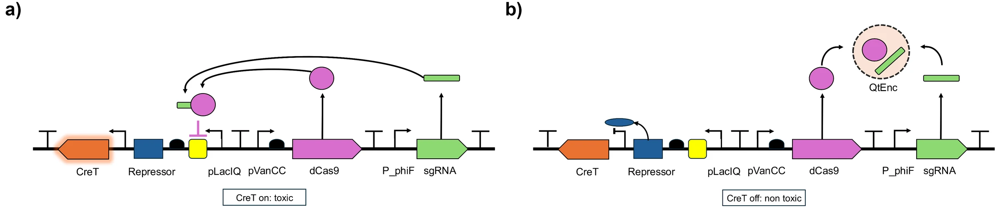](../img/report/s1-cret.webp)

**Fig S1.** Schematic overview of the creT-based positive selection strategy in a repressed (**a**) and an activated (**b**) state.

</figure>

<figure class="report wide" id="fig-s2" markdown>

[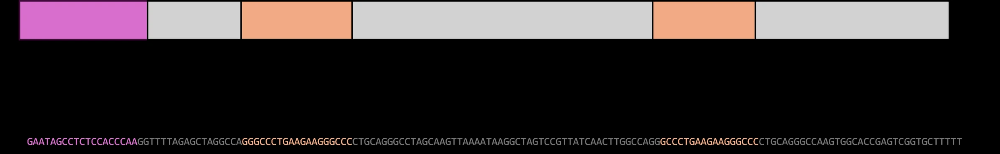](../img/report/s2-sgrna.webp)

**Fig S2.** KanR-based sgRNA sequence including the spacer and the boxB insertion sites.

</figure>

<figure class="report narrow" id="fig-s3" markdown>

[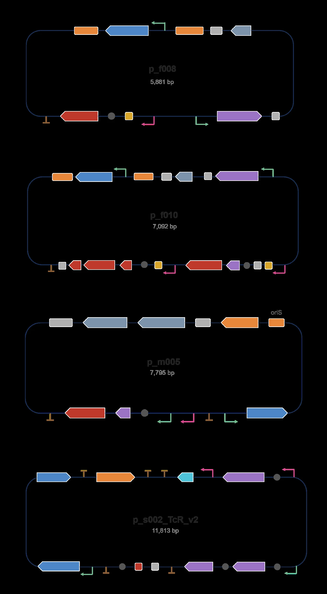](../img/report/s3-plasmid-maps.webp)

**Fig S3.** **Plasmid maps.** Annotated maps of the control plasmid (QtEncapsulin only, `p_f008`, **a**), the engineered plasmid with all elements (`p_f011`, **b**), the mutation plasmid (`p_m005`, **c**) and the selection plasmid (`s_002_TcR_creT_v2`, **d**).

</figure>

<figure class="report wide" id="fig-s4" markdown>

[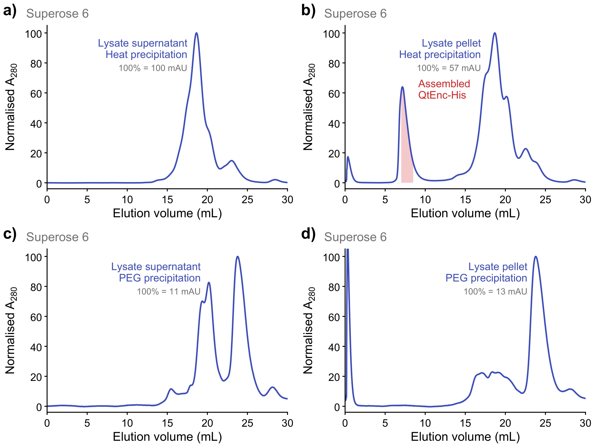](../img/report/s4-sec-precipitation.webp)

**Fig S4.** Analytical SEC of QtEnc-His across four purification workflows, comparing the starting fraction against the precipitation step on a Superose 6 10/300 GL column. The clarified lysate supernatant (**a**, **c**) and the resuspended lysate pellet (**b**, **d**) were each carried forward by heat precipitation (**a**, **b**) or PEG precipitation (**c**, **d**). Only the pellet-derived, heat-precipitated sample (**b**) shows a distinct peak near the column void volume at 7.2 mL (red box), consistent with an assembled T = 4 cage. The other three workflows elute between 13 and 25 mL, the range expected for monomeric and low-order species, and the two PEG routes recover little material (100 % ≈ 11 and 13 mAU, against 100 mAU in **a**). Together these traces indicate that assembled QtEnc-His partitions with the insoluble fraction and is discarded whenever the workflow proceeds from the clarified supernatant, which points to the His-tag compromising cage solubility. A280 is normalised to the maximum of each trace after 1 mL (100 % = 100, 57, 11 and 13 mAU for **a**–**d**).

</figure>

<figure class="report wide" id="fig-s5" markdown>

[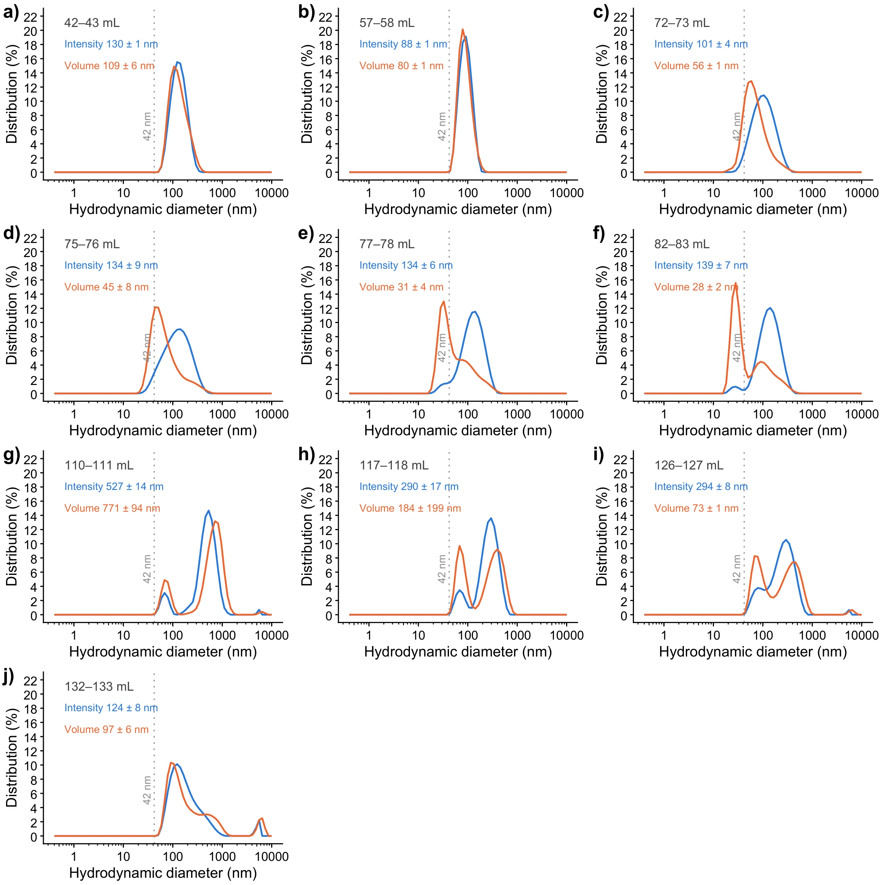](../img/report/s5-dls-f008.webp)

**Fig S5.** DLS of the crude HiPrep Sephacryl S-500 SEC isolation of wt QtEnc. **a**–**e** are different fractions of the SEC in [Fig S9](#fig-s9). Intensity and volume distributions are overlaid to contrast aggregation.

</figure>

<figure class="report wide" id="fig-s6" markdown>

[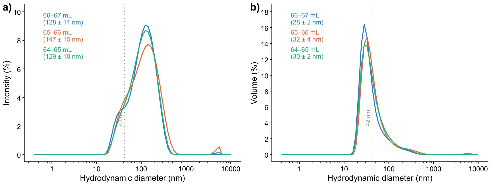](../img/report/s6-dls-f011.webp)

**Fig S6.** DLS of the crude HiPrep Sephacryl S-500 SEC isolation of QtEnc-TP-mScarlet. **a**–**e** are different fractions of the corresponding SEC (data not shown). Intensity and volume distributions are overlaid to contrast aggregation.

</figure>

<figure class="report narrow" id="fig-s7" markdown>

[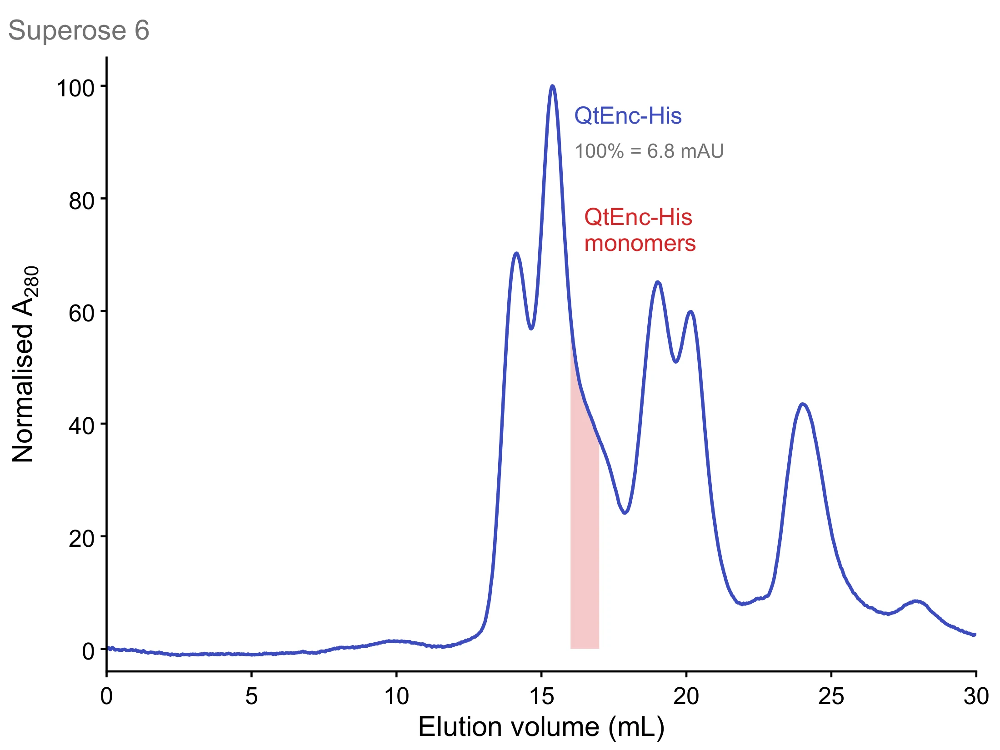](../img/report/s7-sec-monomers.webp)

**Fig S7.** Analytical SEC of QtEnc-His on a Superose 6 10/300 GL column. No peak appears near the void volume; the red box (16–17 mL) marks QtEnc-His monomers identified by anti-His immunoblot of the SEC fractions. A280 is normalised to its maximum after 1 mL (100 % = 6.8 mAU).

</figure>

<figure class="report wide" id="fig-s8" markdown>

[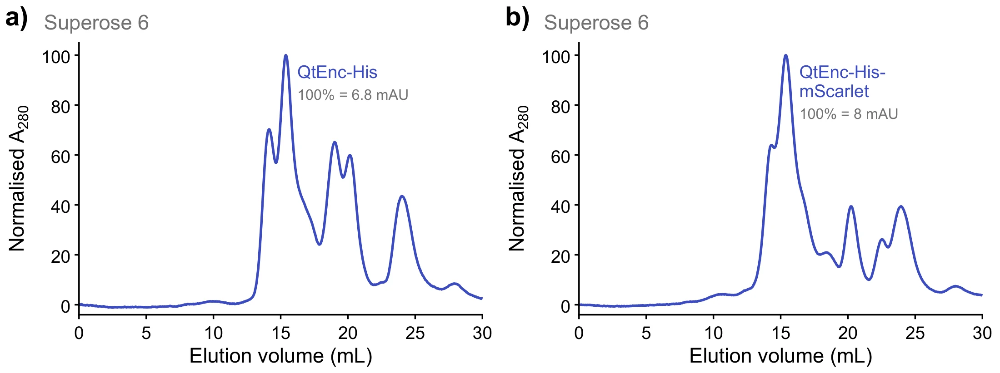](../img/report/s8-sec-nita.webp)

**Fig S8.** Analytical SEC of His-tagged QtEnc constructs after Ni-NTA purification. **(a)** QtEnc-His and **(b)** QtEnc-His-mScarlet, both expressed in *E. coli* BL21 (DE3) with 0.1 mM IPTG and filtered before injection onto a Superose 6 10/300 GL column. Neither trace shows a peak near the void volume (~8 mL); the signal starts at about 13 mL, so no assembled T = 4 cage was recovered by this workflow. A280 is normalised to the maximum of each trace after 1 mL (100 % = 6.8 mAU in **a**, 8 mAU in **b**).

</figure>

<figure class="report wide" id="fig-s9" markdown>

[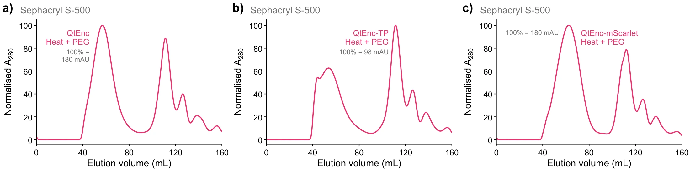](../img/report/s9-sec-s500.webp)

**Fig S9.** Crude SEC of three QtEnc variants under the revised purification protocol. Clarified lysate was subjected to heat precipitation followed by PEG precipitation, filtered, and applied directly to a HiPrep 16/60 Sephacryl S-500 HR column without prior Ni-NTA purification. **(a)** QtEnc, **(b)** QtEnc-TP and **(c)** QtEnc-mScarlet. All three traces begin to rise at about 40 mL and resolve into an early peak at 54–62 mL and a later peak at about 111 mL. The early peak elutes well ahead of the bulk of the soluble proteome and is the species assigned to assembled QtEnc. A280 is normalised to the maximum of each trace after 1 mL (100 % = 180, 98 and 180 mAU for **a**–**c**).

</figure>

<figure class="report wide" id="fig-s10" markdown>

[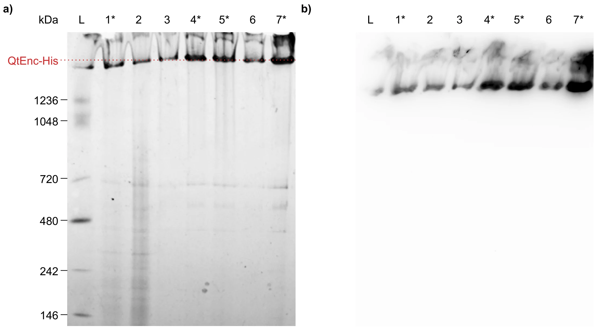](../img/report/s10-bn-antihis.webp)

**Fig S10.** Blue Native PAGE and the corresponding anti-His immunoblot across the QtEnc-His purification. **(a)** Coomassie-stained BN-PAGE and **(b)** anti-His immunoblot of the same steps. L, NativeMark unstained standard; 1, pellet after lysis centrifugation; 2, supernatant after lysis centrifugation; 3, pellet after heat precipitation; 4, supernatant after heat precipitation; 5, supernatant after filtration; 6, Amicon buffer-exchanged flow-through; 7, buffer-exchanged sample after concentration. Asterisks mark the fraction carried forward at each step (lanes 1, 4, 5, 7): the pellet recovered after lysis is the insoluble fraction taken onward, the route followed in **a**, while the paired heat-precipitation pellet (3) and the Amicon flow-through (6) were discarded; the lysis supernatant (2) was processed in a parallel branch not shown here. The dotted line marks the QtEnc-His species, which migrates above the 1236 kDa standard. In **b** the anti-His signal is confined to the same region at the top of the gel, with none detected in the resolved range.

</figure>

<figure class="report wide" id="fig-s11" markdown>

[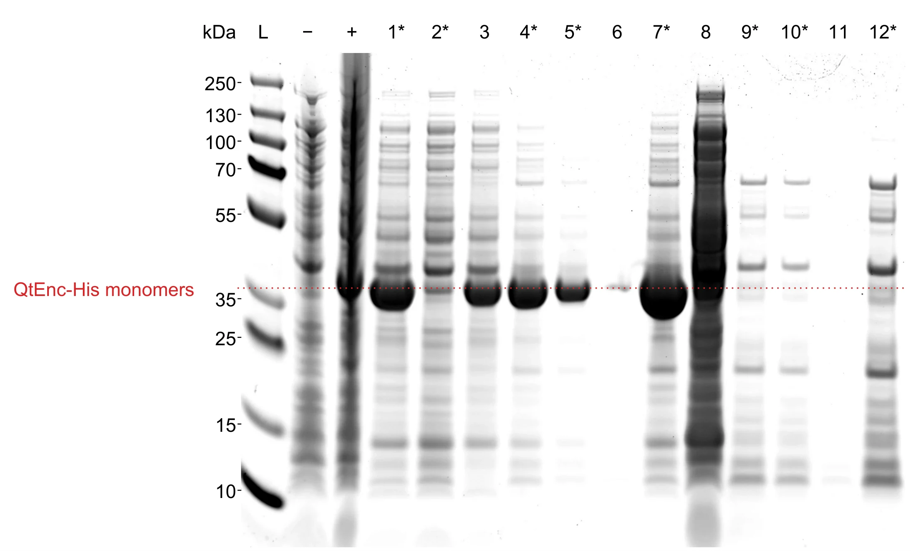](../img/report/s11-sds-workflow.webp)

**Fig S11.** **SDS-PAGE across the QtEnc-His heat-precipitation workflow.** Coomassie Brilliant Blue stained. L, prestained protein standard; − and +, whole cells before and after IPTG induction; 1, pellet after lysis centrifugation; 2, supernatant after lysis centrifugation; 3, pellet after heat precipitation; 4, supernatant after heat precipitation; 5, supernatant after filtration; 6, Amicon buffer-exchanged flow-through; 7, buffer-exchanged sample after concentration. Lanes 8–12 are the corresponding fractions of the parallel branch started from the lysis supernatant: 8, pellet after heat precipitation; 9, supernatant after heat precipitation; 10, supernatant after filtration; 11, Amicon flow-through; 12, sample after concentration. Asterisks mark the fraction carried forward at each step (lanes 1, 2, 4, 5, 7, 9, 10, 12): lysis splits into the pellet (1) and the supernatant (2), which were processed as parallel branches, while the paired heat-precipitation pellets (3, 8) and the Amicon flow-throughs (6, 11) were discarded. The dotted line marks the QtEnc-His monomer, which migrates just above the 35 kDa standard. Lane numbering matches that of the Blue Native PAGE. The image is a single contiguous crop of one scan; processing was limited to levelling, cropping, inversion and one linear intensity window applied to the whole image.

</figure>

<figure class="report wide" id="fig-s12" markdown>

[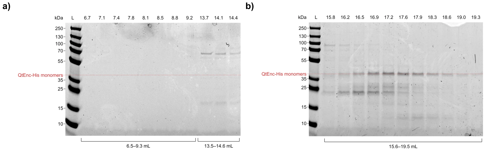](../img/report/s12-sds-fractions.webp)

**Fig S12.** SDS-PAGE of Superose 6 fractions from the SEC run shown in [Fig 4a](../project/results.md#fig4). **a** covers fractions from 6.5 mL to 14.6 mL, **b** fractions from 15 mL to 19.5 mL. QtEnc-His monomers are present around 16–17 mL.

</figure>

<figure class="report wide" id="fig-s13" markdown>

[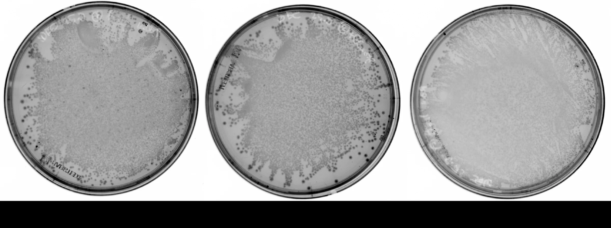](../img/report/s13-stop-codon.webp)

**Fig S13.** Stop-codon reversion assay plates showing induced (+IPTG), repressed (+glucose) and no-additive (basal) conditions. 50 µL of undiluted liquid culture was plated on 25 µg/mL chloramphenicol. Each condition shows growth. Triplicates are not shown.

</figure>

<figure class="report wide" id="fig-s14" markdown>

[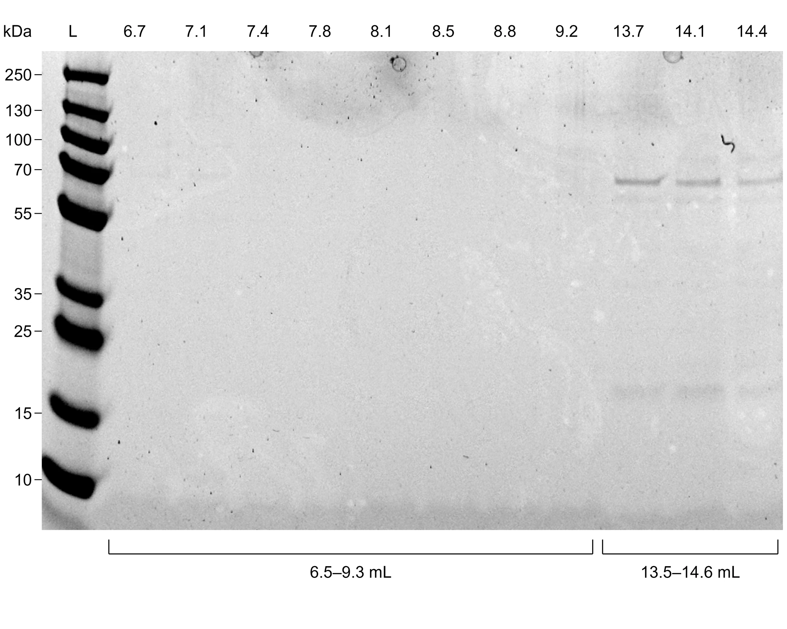](../img/report/s14-sds-superose.webp)

**Fig S14.** SDS-PAGE of QtEnc-His Superose 6 fractions from the SEC run shown in [Fig 4a](../project/results.md#fig4). No QtEnc-His monomers can be identified around the elution-volume peak at ~8 mL.

</figure>
