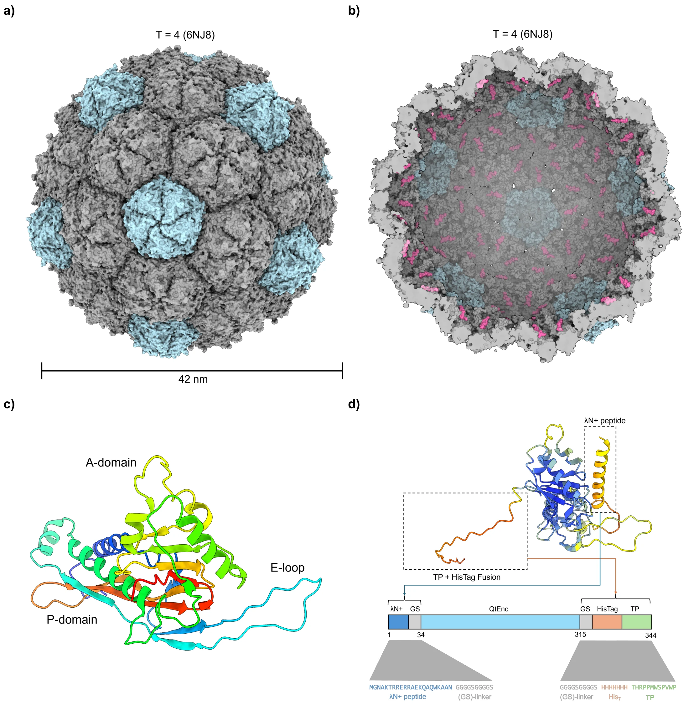
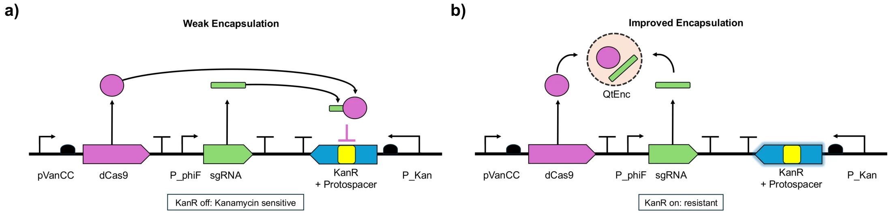
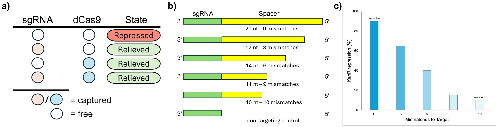
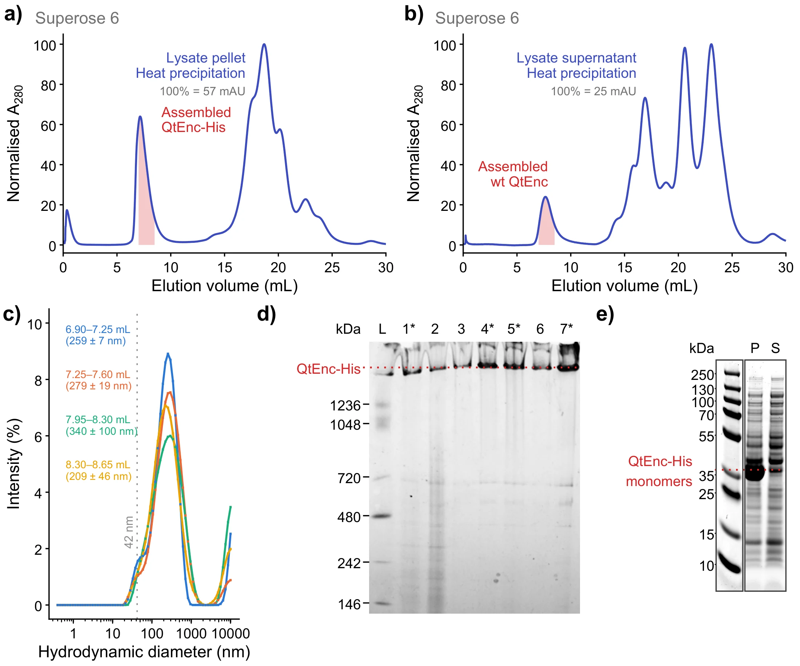

# Results

The continuous evolution campaign has not yet been run. What follows covers the
shell and circuit as designed, the assays that were completed, and the
[outlook](#outlook) for the first campaign.

| Subsystem | State |
| --- | --- |
| Shell variants (inside engineering) | Cloned and sequence-verified (`p_f008`–`p_f011`) |
| Shell expression in *E. coli* BL21 (DE3) | Confirmed by SDS-PAGE and anti-His immunoblot |
| MutaT7 mutagenesis | Functional — stop-codon reversion assay |
| Mutation plasmids (`p_m005`–`p_m007`) | Cloned and sequence-verified |
| Guide truncation series | Designed: non-targeting, 10, 11, 14, 17, 20 nt |
| Selection plasmids (`p_s002` series) | Assembly in progress — see [3.6](#36-cloning-of-the-mutation-and-selection-plasmids) |
| Cage assembly and co-encapsulation | To be demonstrated — see [3.4](#34-purification-and-validation-of-qtencapsulin-cages) |
| Continuous evolution | Planned |

## 3.1 Engineering QtEncapsulin for protein–RNA co-encapsulation

The cargo pair is the ribonucleoprotein of catalytically dead Cas9 (dCas9) and
its sgRNA. The two halves are chemically distinct and each gets its own handle:
dCas9 through a fused cargo-loading peptide (CLP), the sgRNA through a boxB
hairpin.

**Protein handle.** The CLP core motif is five residues and docks to a site on
the lumenal face of the shell, so fusing it is sufficient to direct a protein
inside.[^cassidy] The IMEF targeting peptide is attached to dCas9 at the
established C-terminal fusion site.

**RNA handle.** QtEnc has no native nucleic-acid affinity. The arginine-rich
λN⁺ peptide binds the boxB stem-loop with high affinity and is small enough to
graft.[^laz] Terasaka *et al.* used cationic peptides including λN⁺ to give a
non-viral cage mRNA recognition, with the peptides lining the lumenal edge of
the shell.[^tera] λN⁺ is therefore displayed on the lumenal face of QtEnc. In the
sgRNA, boxB motifs replace the validated MS2 stem-loop insertion sites in the
scaffold stem-loop and tetraloop ([Fig S2](../lab/supplementary.md#fig-s2)).

**External modifications.** The outer shell was first given a His-tag, for
purification and immunoblotting, and a targeting peptide (TP), for delivery.
That combination produced insoluble material (see [3.4](#34-purification-and-validation-of-qtencapsulin-cages)).
Which of the two is responsible was not resolved, so the designs used from there
on carry no external modification. Parallel designs retaining the TP without the
His-tag were also built, to test the TP's effect on its own.

<figure class="report wide" markdown>

**Fig 1.** Structural overview of T = 4 QtEnc (6NJ8). **(a)** Outer shell viewed
down the 5-fold axis. **(b)** Cross-section with the IMEF targeting peptides (TP)
in pink. **(c)** A single subunit in rainbow colouring, with the A-domain,
P-domain and E-loop marked. **(d)** AlphaFold 3 model of QtEnc-HisTag-TP-λN⁺
coloured by pLDDT; the HisTag and TP sit outside and λN⁺ inside, each joined to
QtEnc by a GS linker, with the sequence map below.

</figure>

[^cassidy]: Cassidy-Amstutz *et al.*, *Biochemistry* **55**, 3461 (2016);
    Giessen *et al.*, *eLife* **8**, e46070 (2019).
[^laz]: Lazinski, Grzadzielska & Das, *Cell* **59**, 207 (1989);
    Baron-Benhamou *et al.*, *Methods Mol. Biol.* **257**, 135 (2004).
[^tera]: Terasaka *et al.*, *Proc. Natl. Acad. Sci. USA* **115**, 5432 (2018).

## 3.2 An encapsulation-coupled selection

Engineering inside and outside the shell creates several properties that
evolution can improve: assembly (efficiency, monodispersity, T-number),
stability, and function (protein and RNA loading, tolerance of surface display).
The selection is built to reward the last two through the first.

A dCas9–sgRNA complex represses a kanamycin-resistance gene (*kanR*) on the
selection plasmid. If the complex is sequestered inside QtEnc, repression is
relieved and the cell grows ([Fig 2](#fig2)). Vigouroux *et al.* showed that
the level of complementarity between guide and target sets repression in defined
steps, with less variation than titrating dCas9 itself.[^vig] The guide
truncation series (10, 11, 14, 17 and 20 nt, plus a non-targeting control) turns
that into a tunable selection pressure ([Fig 3](#fig3)). The
[mechanism page](mechanism.md) gives the kinetics.

<figure class="report wide" id="fig2" markdown>

**Fig 2.** KanR-dependent positive selection. **(a)** *Weak or absent
encapsulation:* free dCas9 and sgRNA form an active complex that binds the
protospacer in the KanR 5′-UTR, blocks transcription and leaves the cell
kanamycin-sensitive. **(b)** *Improved encapsulation:* evolved QtEnc variants
assemble around the dCas9–sgRNA cargo. With no free complex the protospacer stays
open, KanR is on, and the cell has a selective advantage.

</figure>

<figure class="report wide" id="fig3" markdown>

**Fig 3.** Principle, design and tuning of the selection. **(a)** When both
components are free in the cytoplasm they repress KanR (*Repressed*); if at least
one is enclosed in the capsid (*Captured*), repression is relieved (*Relieved*).
**(b)** sgRNA variants for tuning binding affinity: the spacer is progressively
truncated while the scaffold, including the PAM-proximal region, stays intact,
alongside a non-targeting control. **(c)** Repression of KanR as a function of
spacer complementarity. More truncation means more mismatches, weaker binding and
less repression, so stringency can be set between sensitive and resistant.

</figure>

[^vig]: Vigouroux *et al.*, *Mol. Syst. Biol.* **14**, e7899 (2018),
    [doi:10.15252/msb.20177899](https://doi.org/10.15252/msb.20177899).

### Regulation and an alternative readout

dCas9 and the sgRNA are expressed under the VanRAM and PhlFAM
regulators, which Meyer *et al.* found to have the largest dynamic range of a
dozen tested while staying orthogonal to each other.[^meyer] Guide
complementarity and inducer concentration are then two independent axes for
tuning the selection, and the pressure can be changed over time.

A second readout based on the CRISPR-regulated toxin–antitoxin system creTA was
explored as an alternative to *kanR*. In archaea, the creA RNA represses creT, a
small RNA toxin that sequesters rare codons.[^li] Chen *et al.* built a sensitive
positive selection on creT for evolving Cas12a.[^chen] Placing the sgRNA's
protospacer in the 5′ UTR of the repressor that controls creT gives the same
logic: encapsulating dCas9 or the sgRNA is rewarded with growth
([Fig S1](../lab/supplementary.md#fig-s1)).

[^meyer]: Meyer *et al.*, *Nat. Chem. Biol.* **15**, 196 (2019).
[^li]: Li *et al.*, *Science* **372** (2021), "Toxin–antitoxin RNA pairs
    safeguard CRISPR-Cas systems".
[^chen]: Chen *et al.*, *Adv. Sci.* **12**, e17105 (2025).

## 3.3 Mutation and selection plasmids

The circuit is split across two compatible plasmids so that only the shell gene
is diversified. The mutation plasmid carries the MutaT7 fusion and the QtEnc
open reading frame between a T7 promoter and terminator; that cassette is the
only hypermutated locus. The selection plasmid carries dCas9, the sgRNA cassette
and *kanR* ([Fig S3](../lab/supplementary.md#fig-s3)).

The split is a containment measure. A mutation that lowers dCas9 or sgRNA
expression restores resistance without improving encapsulation and would be
enriched as strongly as a genuine improvement, so both sit outside the T7
transcription unit. That protects them from hypermutation, not from host
polymerase error, so the selection plasmid is re-sequenced periodically during
passaging.

## 3.4 Purification and validation of QtEncapsulin cages

His-tagged QtEnc (QtEnc-His) was expressed in *E. coli* BL21 (DE3). Monomer
expression was confirmed by SDS-PAGE across the purification steps
([Fig S11](../lab/supplementary.md#fig-s11)), and the monomer elutes at
16–17 mL on Superose 6 ([Fig S7](../lab/supplementary.md#fig-s7),
[S12](../lab/supplementary.md#fig-s12)).

**The His-tag moves QtEnc into the insoluble fraction.** After Ni-NTA purification
of the soluble fraction, analytical SEC shows no void-volume peak
([Fig S8](../lab/supplementary.md#fig-s8)). Fractionating the lysate shows that
most QtEnc-His is in the pellet ([Fig 4e](#fig4)). Continuing from the insoluble
fraction by heat precipitation, without Ni-NTA, gives a void-volume peak in SEC
([Fig 4a](#fig4)) and a high-molecular-weight species on Blue Native PAGE that
reacts with anti-His ([Fig 4d](#fig4), [Fig S10](../lab/supplementary.md#fig-s10)).
Of the four workflows compared, only the pellet-derived, heat-precipitated sample
shows this peak ([Fig S4](../lab/supplementary.md#fig-s4)).

**Size by DLS.** Fractions across the QtEnc-His void-volume peak read 209–340 nm
([Fig 4c](#fig4)), against 42 nm expected for a T = 4 cage, so the species is
larger than a single cage. Void-volume elution and native-gel migration cannot
separate large aggregates from assembled cages; negative-stain TEM or cryo-EM is
the orthogonal test (see [outlook](#outlook)). Removing the His-tag recovers
QtEnc in the soluble fraction, with a void-volume peak at 7.6 mL
([Fig 4b](#fig4)). DLS of wild-type QtEnc and of QtEnc-TP-mScarlet from the crude
Sephacryl S-500 step gave no defined peak near 42 nm, and the intensity and
volume distributions differ in a way that indicates aggregation
([Fig S5](../lab/supplementary.md#fig-s5),
[S6](../lab/supplementary.md#fig-s6)).

<figure class="report wide" id="fig4" markdown>

**Fig 4.** Analytical SEC after heat precipitation on a Superose 6 10/300 GL
column. **(a)** QtEnc-His from the insoluble lysate fraction (resuspended
pellet), purified without Ni-NTA, and **(b)** wt QtEnc from the clarified lysate
supernatant. Both show a peak near the void volume, at 7.2 mL in a and 7.6 mL in
b (shaded, 7–8.5 mL). A280 is normalised to the maximum of each trace
after 1 mL (100 % = 57 mAU in a, 25 mAU in b). **(c)** Intensity-weighted DLS of
four consecutive 0.35 mL fractions across the void-volume peak in a, each the
mean of 2–3 runs, labelled by elution volume; brackets give the peak diameter as
mean ± SD across runs. The dotted line marks the 42 nm expected for the T = 4
cage; every fraction peaks between 209 and 340 nm. **(d)** Blue Native PAGE
across the QtEnc-His purification by heat precipitation, Coomassie-stained. L,
NativeMark standard; 1, pellet after lysis; 2, supernatant after lysis; 3, pellet
after heat precipitation; 4, supernatant after heat precipitation; 5, supernatant
after filtration; 6, Amicon flow-through; 7, concentrated sample. Asterisks mark
the fraction carried forward at each step (lanes 1, 4, 5, 7). QtEnc-His migrates
above the 1236 kDa standard. **(e)** SDS-PAGE of the pellet (P) and supernatant
(S) after lysis: most QtEnc-His is in the pellet.

</figure>

## 3.5 Stop-codon reversion assay

Before any evolution campaign, MutaT7 mutagenesis was tested in a simple
reporter. An early stop codon was placed in a chloramphenicol-resistance gene
(CmR) by changing a Trp codon to a stop (TGG → TAG), so restoring resistance
needs the A→G deamination activity of MutaT7. Colonies grew on 25 µg/mL
chloramphenicol ([Fig S13](../lab/supplementary.md#fig-s13)), so the system is
operable.

The stop codon reverted under all three conditions — +IPTG, +glucose and basal —
with similar colony counts for the undiluted cultures. That points to leaky
MutaT7 expression, which the outlook addresses.

## 3.6 Cloning of the mutation and selection plasmids

Constructs were assembled by Golden Gate with synthetic gene fragments (Twist
Bioscience) and PCR products. All mutation plasmids were cloned and
sequence-verified. For the selection plasmids, whole-plasmid sequencing of the
Golden Gate reactions shows that four of the five BsaI junctions form and that
all five parts are covered without gaps ([Table S2](../lab/supplementary.md#table-s2)).
No read spans all junctions at once, so assembly of the full plasmid is the open
step. The plasmid inventory is in [Table S1](../lab/supplementary.md#table-s1).

## Outlook

The campaign depends on three things, in the order they can be tested.

**1. Cage assembly with and without the external tag.** The data point to the
His-tag as the driver of aggregation. The next constructs drop it and keep the
targeting peptide, and a DLS baseline on wild-type cages gives the reference for
42 nm. Negative-stain TEM or cryo-EM would confirm assembly independently of
elution volume and native-gel migration. Mixing monomers with and without an
external moiety in defined ratios, to make mosaic cages, is a further route to
tolerating external fusions.[^mosaic]

**2. The selection plasmids.** The J5 junction (TcR to backbone) is the one not
observed: the backbone ligated to `s001` through an overhang pair differing at a
single position (GATA/GAAA), excising the TcR cassette. That explains the
missing cassette but not the lack of colonies, since the product still carries
the kanamycin marker. Leaky expression of dCas9 and the guide, unrepressed
without VanRAM and PhlFAM, is the more likely burden. The
options are chemical promoter repression, a non-targeting guide as a proof of
concept, and a tri-plasmid design that introduces the regulators first, from a
separate plasmid.

**3. Mutagenesis control.** An inducible sgRNA directed at the T7 promoter region
would suppress the leaky MutaT7 activity seen in [3.5](#35-stop-codon-reversion-assay).

With these in place the [planned campaign](future.md#planned-campaign) can start,
and enriched shell alleles can be re-cloned and tested by the
[co-encapsulation assays](../lab/protocols.md#co-encapsulation-assays). The
longer list is on the [future work](future.md) page.

[^mosaic]: Boyton *et al.*, *ACS Omega* **7**, 823 (2022); Charron *et al.*,
    *FEBS J.* **293**, 1908 (2026). Full list on the
    [references page](references.md).
