# Team and sponsors

Evolution Suisse 2026 is a team of students from ETH Zürich and the University of
Zürich. The project was carried out in the Lang group at ETH Zürich and hosted by
the Student BioLab Zürich.

## The team

  <!-- luca-vogt -->
  <article class="person">
    
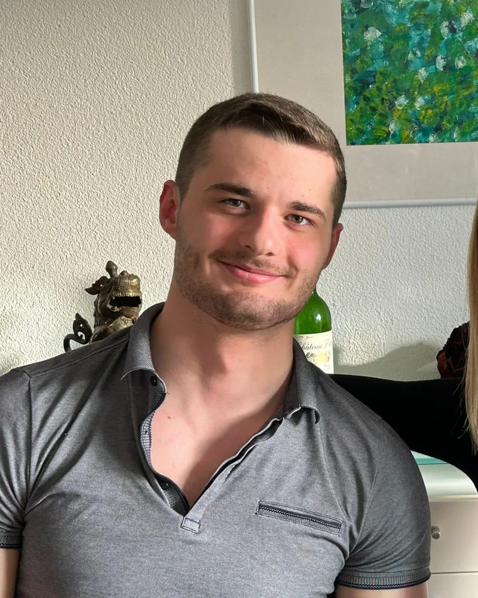

    
Luca Vogt

    
Department of Biosystems Science and Engineering, ETH Zürich

    
Concept development, Wet lab lead, dry lab

    
<a href="https://www.linkedin.com/in/luca-vogt-2034a42a3/" rel="external" aria-label="Luca Vogt on LinkedIn">LinkedIn ↗</a>

  </article>
  <!-- klara-tkacz -->
  <article class="person">
    
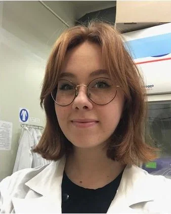

    
Klara Tkacz

    
Department of Biosystems Science and Engineering, ETH Zürich

    
Wet lab, funding

    
<a href="https://www.linkedin.com/in/klara-tkacz-0133a8396/" rel="external" aria-label="Klara Tkacz on LinkedIn">LinkedIn ↗</a>

  </article>
  <!-- max-schaebinger -->
  <article class="person">
    
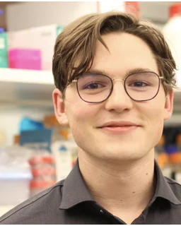

    
Max Schäbinger

    
Faculty of Science, Universität Zürich

    
Wet lab, funding

    
<a href="https://www.linkedin.com/in/max-schaebinger/" rel="external" aria-label="Max Schäbinger on LinkedIn">LinkedIn ↗</a>

  </article>
  <!-- oliver-nagl -->
  <article class="person">
    
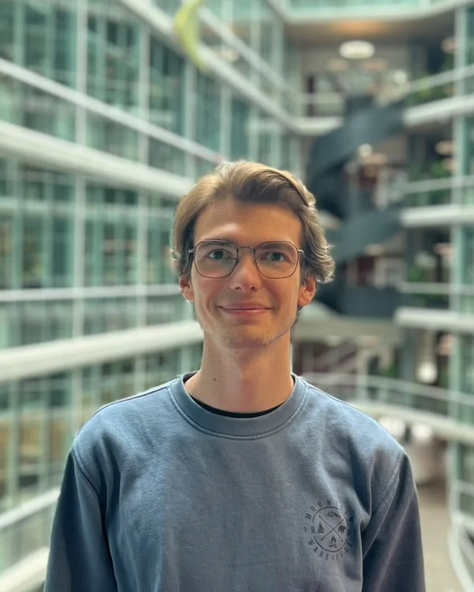

    
Oliver Nagl

    
Department of Biosystems Science and Engineering, ETH Zürich

    
Concept development, dry lab, wiki

    
<a href="https://www.linkedin.com/in/oliver-nagl-41a40a1b0/" rel="external" aria-label="Oliver Nagl on LinkedIn">LinkedIn ↗</a>

  </article>
  <!-- nathania-calista-putri -->
  <article class="person">
    
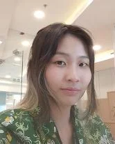

    
Nathania Calista Putri

    
Department of Biology, ETH Zürich

    
Wet lab

    
<a href="https://www.linkedin.com/in/nathania-calista-putri/" rel="external" aria-label="Nathania Calista Putri on LinkedIn">LinkedIn ↗</a>

  </article>
  <!-- noel-lippold -->
  <article class="person">
    
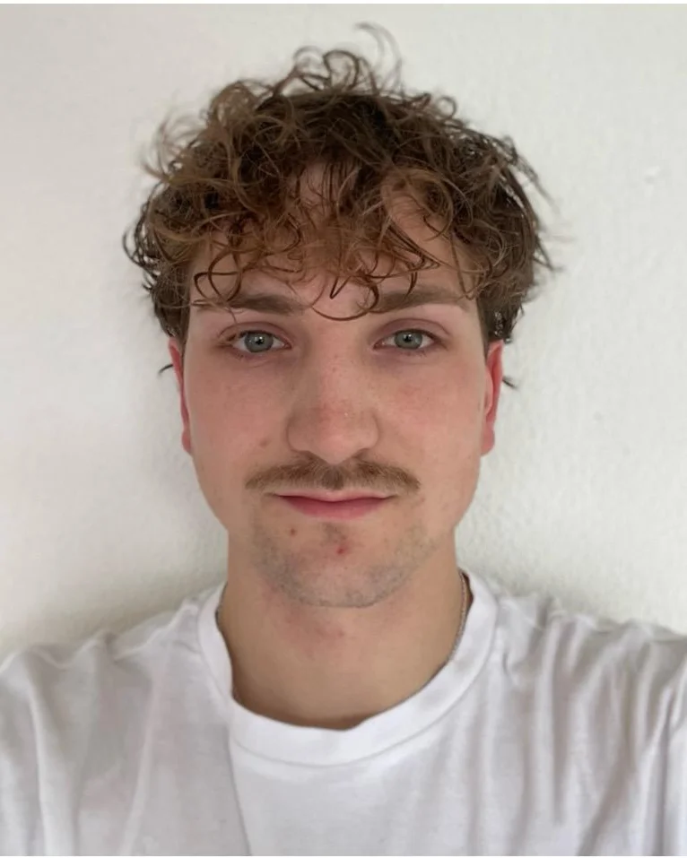

    
Noel Lippold

    
Department of Chemistry and Applied Biosciences, ETH Zürich

    
Wet lab, funding &amp; finances

    
<a href="https://www.linkedin.com/in/noel-pascal-l-b7a196190/" rel="external" aria-label="Noel Lippold on LinkedIn">LinkedIn ↗</a>

  </article>

## Supervision

  <!-- daria-belous -->
  <article class="person person--sup">
    
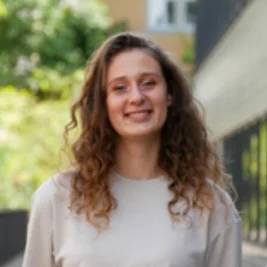

    
Daria Belous

    
Supervisor

  </article>
  <!-- annabelle-winzer -->
  <article class="person person--sup">
    
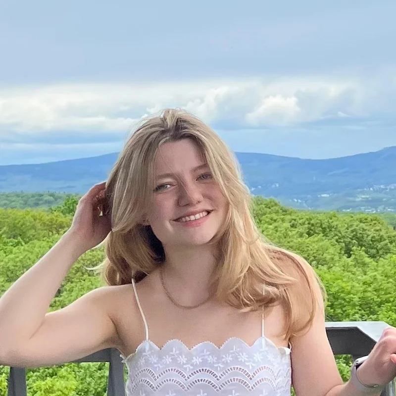

    
Annabelle Winzer

    
Supervisor

  </article>
  <!-- kathrin-lang -->
  <article class="person person--sup">
    
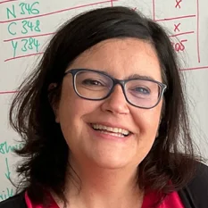

    
Prof. Dr. Kathrin Lang

    
Principal investigator, ETH Zürich

  </article>

### Advisors and collaborators

<ul class="crew-chips">
  <li><strong>Dr. Maximilian Fottner</strong></li>
  <li><strong>Dr. Vera Wanka</strong></li>
  <li><strong>Paul Schnacke</strong></li>
  <li><strong>Kian Bigović Villi</strong></li>
  <li><strong>Philip Nitsch</strong></li>
  <li><strong>Dr. Mikail Levasseur</strong> cage purification</li>
  <li><strong>Hilvert Lab</strong> initial project idea</li>
</ul>

Acknowledgments are on the [attributions](attributions.md) page.

## Sponsors

  

    
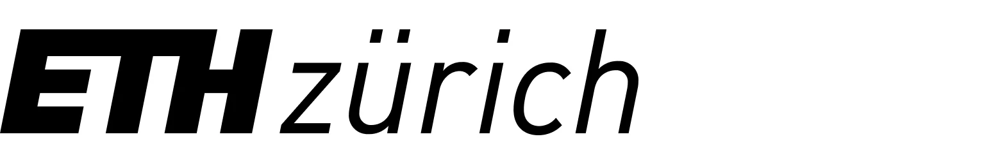

    
ETH Zürich

  

  

    
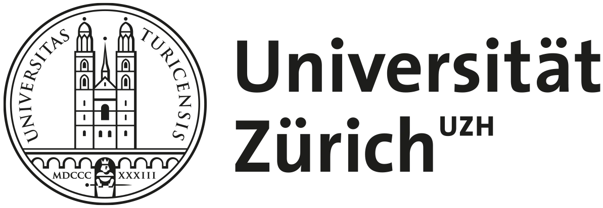

    
Universität Zürich

  

  

    
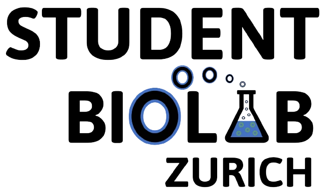

    
Student BioLab Zürich

  

  

    
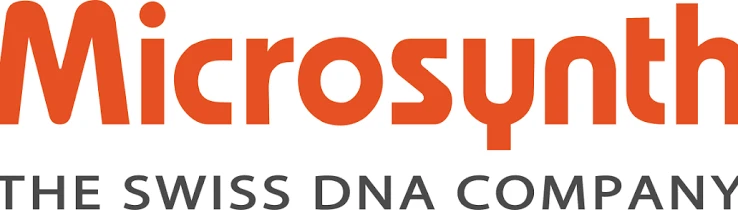

    
Microsynth AG

  

